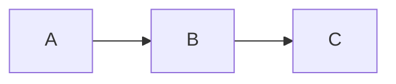

# MC1 — Fundamentos de IA y flujo de trabajo con datos

Documentación as-code del módulo 1 de la microcredencial de IA, construida con [Fumadocs](https://fumadocs.vercel.app/) + Next.js.

## Requisitos

- Node.js 22+
- npm / pnpm / yarn

## Inicio rápido

```bash
npm install
npm run dev
```

Abre [http://localhost:3000](http://localhost:3000).

## Estructura del proyecto

```text
csic-micro-1/
├── app/                          # Next.js App Router
│   ├── layout.tsx                # Root layout (RootProvider)
│   ├── page.tsx                  # Redirige a /docs
│   └── docs/
│       ├── layout.tsx            # DocsLayout (sidebar)
│       └── [[...slug]]/
│           └── page.tsx          # Renderiza cualquier página MDX
│
├── content/docs/                 # Fuente de verdad — todo en MDX
│   ├── meta.json                 # Orden del sidebar raíz
│   ├── index.mdx                 # Página de bienvenida
│   └── mc1/
│       ├── meta.json             # Orden del sidebar MC1
│       ├── index.mdx
│       ├── 01-que-es-ia.mdx      # Bloque 1 (Lara)
│       ├── 02-datos.mdx          # Bloque 2 (Carlos)
│       ├── 03-como-aprenden.mdx  # Bloque 3 (Lara)
│       ├── 04-deep-learning.mdx  # Bloque 4 (Lara)
│       ├── 05-proyecto-ia.mdx    # Bloque 5 (Carlos)
│       ├── 06-prototipo-sistema.mdx # Bloque 6 (Carlos)
│       └── capstone.mdx          # Proyecto final
│
├── assets/
│   ├── diagrams/                 # Fuente Mermaid (.mmd) — una por diagrama
│   │   ├── conjuntos-ia-ml-dl.mmd
│   │   ├── crisp-dm.mmd
│   │   ├── pipeline-datos.mmd
│   │   ├── tidy-data.mmd
│   │   ├── transformer-atencion.mmd
│   │   └── monitorizacion.mmd
│   └── images/                   # Imágenes originales (alta resolución)
│
├── public/images/                # Imágenes optimizadas servidas por Next.js
│
├── lib/source.ts                 # Loader de Fumadocs
├── source.config.ts              # Configuración MDX + remark-mermaid
├── next.config.mjs
├── tsconfig.json
└── package.json
```

## Convenciones de contenido

### Frontmatter obligatorio

```mdx
---
title: "N. Título del bloque"
description: Resumen de una línea
author: Nombre
---
```

### Diagramas Mermaid

Los diagramas viven en `assets/diagrams/*.mmd` como fuente de verdad.
Para incrustarlo en un MDX:

````mdx

````

Fumadocs renderiza los bloques Mermaid automáticamente vía `remarkMermaid`.

### Imágenes

- Originales en `assets/images/`
- Copiar/exportar a `public/images/` para que Next.js las sirva
- Referenciar como ``

### Comentarios de trabajo en progreso

Usa comentarios JSX para marcar secciones pendientes:

```mdx
{/* TODO: desarrollar */}
```

## Scripts

| Comando         | Descripción                              |
| --------------- | ---------------------------------------- |
| `npm run dev`   | Servidor de desarrollo en localhost:3000 |
| `npm run build` | Build de producción                      |
| `npm run start` | Servir el build de producción            |

## Autores

- **Lara** — Bloques 1, 3, 4
- **Carlos** — Bloques 2, 5, 6
