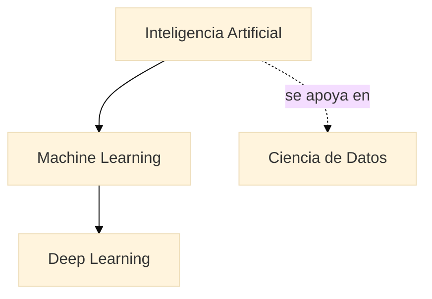

{/* TODO: Lara desarrolla */}

## Qué es IA, ML y Deep Learning

{/* Conjuntos anidados: dónde encaja la ciencia de datos */}

## Qué puede hacer y qué no

{/* Capacidades reales vs expectativas; generalización */}

## Cómo aprende un modelo

{/* Patrón, datos, ajuste; aprender ≠ memorizar */}

## IA generativa vs predictiva

{/* Predecir etiqueta vs generar contenido */}

## Ejemplos reales

{/* Un caso por familia de dato */}

---

## Práctica 1

**Sin código.** Clasificar casos de uso reales en _generativa_ / _predictiva_ / _no-es-IA_, justificando cada decisión.
