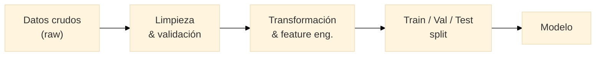

{/* TODO: Carlos desarrolla */}

## Tipos de datos

{/* Estructurados, semiestructurados (JSON, XML, logs), no estructurados (texto, imagen, señal, espectros) */}

## De dónde vienen los datos

{/* Ficheros, BBDDs, APIs, scraping, sensores, datos abiertos y repositorios FAIR */}
{/* Formatos: CSV, Parquet, JSON, HDF5 */}

## Limpieza y transformación

{/* Valores ausentes, atípicos, duplicados, normalización, codificación, fechas y texto */}

## Estructuración: tidy data

{/* De dato crudo a tabla analizable; principios tidy data; desnormalización; uniones y agregaciones */}

## Calidad del dato

{/* Completitud, consistencia, validez, unicidad, actualidad */}
{/* Data leakage, sesgo de muestreo, garbage in/garbage out */}

## Introducción a pipelines

{/* Flujo reproducible; notebook exploratoria vs script productivo */}

---

## Práctica 2

Dataset deliberadamente sucio (ausentes, formatos inconsistentes, duplicados, fuga de información plantada).

**Entregable:** notebook con dataset limpio + bitácora con cada decisión justificada, incluyendo detección y eliminación de la fuga.
