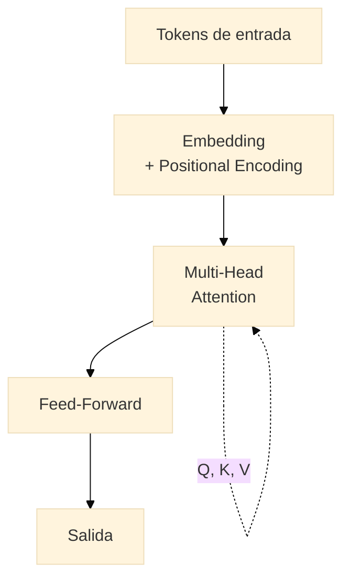

{/* TODO: Lara desarrolla */}

## Redes neuronales

{/* Neurona, capas, no linealidad */}

## CNNs

{/* Convolución como detector de patrones locales; imagen y señal */}

## Secuencias y RNNs

{/* Datos con orden temporal */}

## Atención y transformers

{/* La idea de atención */}

## LLMs y modelos generativos

{/* Del transformer al LLM; capacidades, alucinación, límites */}

---

## Práctica 4

**Sin entrenar desde cero.** Usar un modelo preentrenado o LLM zero-shot sobre un caso propio y analizar aciertos y fallos.
