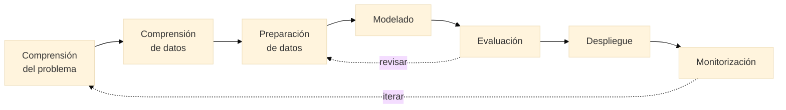

{/* TODO: Carlos desarrolla */}

## Fases de un proyecto

{/* CRISP-DM ligero: comprensión del problema → datos → preparación → modelado → evaluación → despliegue → monitorización */}
{/* Iterativo, no lineal; el 80% del esfuerzo está antes del modelo */}



## Roles implicados

{/* Investigador de dominio, data scientist, data engineer, ML engineer/MLOps, responsable de datos */}

## Herramientas y arquitecturas

{/* Stack mínimo viable: venv/conda, git, notebooks vs scripts */}
{/* Batch vs tiempo real, on-premise vs nube */}

## Estructura de repositorio

{/* Carpetas: datos, código, modelos, resultados; configuración separada; semillas y reproducibilidad */}

```
proyecto/
├── data/
│   ├── raw/
│   ├── processed/
│   └── external/
├── notebooks/
├── src/
├── models/
├── results/
├── .env.example
├── requirements.txt
└── README.md
```

## Pipelines sencillos

{/* Ingestión → preparación → entrenamiento → evaluación como pasos reproducibles */}

---

## Práctica 5

Diseñar el plan completo de un proyecto de IA sobre un problema de la propia disciplina (fases, datos, roles, riesgos, stack) y montar el esqueleto de repositorio reproducible vacío pero ejecutable.

**Entregable:** documento de diseño de una página + repositorio con estructura y README.
