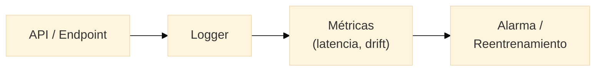

{/* TODO: Carlos desarrolla */}

## APIs y despliegue

{/* Por qué un modelo en un notebook no sirve a nadie; endpoint; FastAPI; entrada/salida; serialización */}

## Integración en aplicaciones

{/* Cómo otro sistema consume el modelo (HTTP, JSON); contrato de la API; versionado */}

## Automatización

{/* De ejecución manual a flujo programado; Docker como "funciona en cualquier máquina" */}

## Monitorización básica

{/* Data drift, deriva del modelo, latencia; cuándo reentrenar; logging mínimo */}

## Casos reales end-to-end

{/* Uno o dos proyectos completos de dato a servicio */}

---

## Práctica 6

Envolver el modelo de la **Práctica 3** en una API mínima con FastAPI: validar entrada, devolver predicción vía HTTP, y (opcional avanzado) contenerizar con Docker.

**Entregable:** repositorio con API ejecutable, README de uso y ejemplo de petición.
